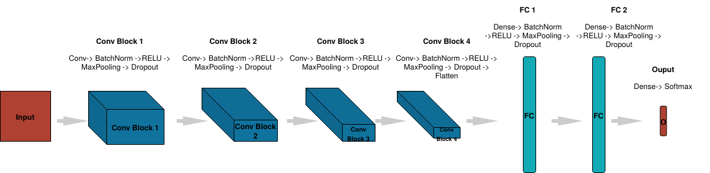
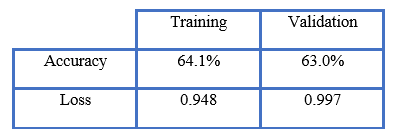

# Emotion Recognition using Keras

1.  **INTRODUCTION**

A facial recognition system is a technology capable of identifying or verifying a person from a digital image or a video frame from a video source. There are multiple methods in which facial recognition systems work, but in general, they work by comparing selected facial features from given image with faces within a database. It is also described as a Biometric Artificial Intelligence based application that can uniquely identify a person by analyzing patterns based on the person's facial textures and shape.

Face recognition systems use computer algorithms to pick out specific, distinctive details about a person’s face. These details, such as distance between the eyes or shape of the chin, are then converted into a mathematical representation and compared to data on other faces collected in a face recognition database. The data about a particular face is often called a face template and is distinct from a photograph because it’s designed to only include certain details that can be used to distinguish one face from another. 

Some face recognition systems, instead of positively identifying an unknown person, are designed to calculate a probability match score between the unknown person and specific face templates stored in the database. These systems will offer up several potential matches, ranked in order of likelihood of correct identification, instead of just returning a single result. 

Face recognition systems vary in their ability to identify people under challenging conditions such as poor lighting, low quality image resolution, and suboptimal angle of view (such as in a photograph taken from above looking down on an unknown person). Face recognition data can also be prone to error, which can implicate people for crimes they haven’t committed. Facial recognition software is particularly bad at recognizing African Americans and other ethnic minorities, women, and young people, often misidentifying or failing to identify them, disparately impacting certain groups.

Additionally, face recognition has been used to target people engaging in protected speech. In the near future, face recognition technology will likely become more ubiquitous. It may be used to track individuals’ movements out in the world like automated license plate readers track vehicles by plate numbers. Real-time face recognition is already being used in other countries and even at sporting events in the United States.

In this project a convolutional neural network (CNN) is built and trained in Keras to recognize facial expressions. The dataset consists of 48x48 pixel grayscale images of faces. Each face is classified based on the emotion shown in the facial expression into one of seven categories (0=Angry, 1=Disgust, 2=Fear, 3=Happy, 4=Sad, 5=Surprise, 6=Neutral). OpenCV is used to automatically detect faces in images and draw bounding boxes around them. Once trained, the CNN, will directly serve the trained model predictions to a web interface and perform real-time facial expression recognition on video and image data.

2.  **TOOLS USED**

  **TensorFlow**

TensorFlow is a free and open-source software library for dataflow and differentiable programming across a range of tasks. It is a symbolic math library, and is also used for machine learning applications such as neural networks. It is used for both research and production at Google.

  **Keras**

Keras is an open-source neural-network library written in Python. It is capable of running on top of TensorFlow, Microsoft Cognitive Toolkit, R, Theano, or PlaidML. Designed to enable fast experimentation with deep neural networks, it focuses on being user-friendly, modular, and extensible. It was developed as part of the research effort of project ONEIROS (Open-ended Neuro-Electronic Intelligent Robot Operating System), and its primary author and maintainer is François Chollet, a Google engineer. Chollet also is the author of the XCeption deep neural network model. 

Keras is based on minimal structure that provides a clean and easy way to create deep learning models based on TensorFlow or Theano. Keras is designed to quickly define deep learning models. Well, Keras is an optimal choice for deep learning applications.

  **OpenCV**

OpenCV (Open Source Computer Vision Library) is a library of programming functions mainly aimed at real-time computer vision. Originally developed by Intel, it was later supported by Willow Garage then Itseez (which was later acquired by Intel). The library is cross-platform and free for use under the open-source BSD license.
OpenCV is a cross-platform library using which we can develop real-time computer vision applications. It mainly focuses on image processing, video capture and analysis including features like face detection and object detection. Computer Vision can be defined as a discipline that explains how to reconstruct, interrupt, and understand a 3D scene from its 2D images, in terms of the properties of the structure present in the scene. It deals with modeling and replicating human vision using computer software and hardware.

  **Flask**

Flask is a micro web framework written in Python. It is classified as a microframework because it does not require particular tools or libraries. It has no database abstraction layer, form validation, or any other components where pre-existing third-party libraries provide common functions. However, Flask supports extensions that can add application features as if they were implemented in Flask itself. Extensions exist for object-relational mappers, form validation, upload handling, various open authentication technologies and several common framework related tools. Extensions are updated far more frequently than the core Flask program. Applications that use the Flask framework include Pinterest and LinkedIn.
Web Server Gateway Interface (WSGI) has been adopted as a standard for Python web application development. WSGI is a specification for a universal interface between the web server and the web applications. Werkzeug is a WSGI toolkit, which implements requests, response objects, and other utility functions. This enables building a web framework on top of it. The Flask framework uses Werkzeug as one of its bases.

  **Jupyter**

Project Jupyter is a non-profit organization created to "develop open-source software, open-standards, and services for interactive computing across dozens of programming languages". 
As a server-client application, the Jupyter Notebook App allows to edit and run notebooks via a web browser. The application can be executed on a PC without Internet access, or it can be installed on a remote server, where it can be accessed through the Internet.
Its two main components are the kernels and a dashboard.
A kernel is a program that runs and introspects the user’s code. The Jupyter Notebook App has a kernel for Python code, but there are also kernels available for other programming languages. The dashboard of the application not only shows the notebook documents that have been made and can reopen but can also be used to manage the running kernels and shut them down if necessary.

3.  **DATASET**

The dataset consists of 48x48 pixel grayscale images of faces. The faces
have been automatically registered so that the face is more or less
centered and occupies about the same amount of space in each image. Each
face is based on the emotion shown in the facial expression in one of
seven categories (Angry, Disgust, Fear, Happy, Sad, Surprise, Neutral).

The training set consists of 28,708 images and the test set consists of
7,178 images. Compressed version of the dataset takes 92 MB space
whereas uncompressed version takes 140 MB space.

This dataset was prepared by Pierre-Luc Carrier and Aaron Courville for
the Facial Expression Recognition Challenge 2013 (kaggle).

4.  **METHODOLOGY**

The CNN model is designed and trained using Keras. We use OpenCV for
face detection by using its face detection classifier to draw bounding
boxes around the automatically detected faces. After developing the
facial model, the network is trained and saved. Then the trained model
is deployed through a web interface built using Flask. Once the Emotion
Recognition model is trained, we run the main python script which loads
the trained model and saved weights by which finally the model is
applied to a locally saved video file or to a real-time video stream
through a webcam.

1.  **Importing the libraries**

The following libraries are imported: -

import numpy as np

import seaborn as sns

import matplotlib.pyplot as plt

import utils

import os

from livelossplot import PlotLossesKerasTF

import tensorflow as tf

Further some modules from the Tensorflow library are also imported.

2.  **Creating training and validation batches**

Keras is used to automatically feed data from the training and test
folder to create mini-batches for training and validation(test). Some
hyper-parameter settings are defined for the data loader. Image size is
taken 48x48 and the batch size is 64. The batch size is a hyperparameter
of gradient descent that controls the number of training samples to work
through before the model's internal parameters are updated. Data
generators for both training and validation set is created using the
ImageDataGenerator function of Keras while randomly flipping images on
their horizontal axis.

3.  **Creating the CNN Model**

A sequential CNN model is used in this project. The input first passes
through 4 convolution blocks. The number of filters is gradually
increased which is the general workflow of various convolution
architectures. In each block Convolution, Batch Normalization, RELU
(non-linearity), Max Pooling and Dropout regularization is applied on
the data. At each convolution bock the volume is reduced by a factor of
2 while the number of channels nearly doubles. The output is flattened
after the fourth convolution block and then passed on to the two fully
connected layers. Finally, the dense layer with Softmax Activation is
used to predict the output label which corresponds to on of the seven
emotions. Adam optimizer is used with a learning rate of 0.0005 which
speeds up the training to about 9 minutes per epoch. model.summary()
function is used to output all the parameters which the Model will have
to learn (around 3 million in this case).

4.  **Training and evaluating the Model**

First, we select the number of epochs to be 15. The number of epochs is
a hyperparameter of gradient descent that controls the number of
complete passes through the training dataset. Steps per epoch are
calculated by doing a floor division of the number of images in the
training generator with the batch size of the training generator. This
is repeated for the validation set. Then three callbacks are added to
the training. A callback is an object that can perform actions at
various stages of training (e.g. at the start or end of an epoch, before
or after a single batch, etc). First callback is ReduceLROnPlateau which
reduces the learning rate when there is no improvement in the validation
loss after two epochs. ModelCheckpoint callback is used to save the
model weights with higher validation accuracy. Model weights are saved
to HDF5 format. This is a grid format that is
ideal for storing multi-dimensional arrays of numbers. PlotLossesKerasTF
is used to observe the training loss per epoch and the accuracy per
epoch plots in real time. Each epoch takes around 9-10 minutes. The
first epoch takes the longest time as resource allocation has to be done
for the GPU, various libraries have to be loaded and files for
optimization also have to be loaded. The total time taken is around 2.5
hours.

5.  **Saving the Model architecture as JSON**

JSON is a simple file format for describing data hierarchically. The
model\'s architecture (configuration) specifies what layers the model
contains, and how these layers are connected. The model architecture is
stored using to_json() which uses a JSON. The model is then converted to
JSON format and written to model.json in the local directory.

6.  **Class to output Model predictions**

A FacialExpressionModel class is created to load the model from the JSON
file, load the trained weights into the model, and predict facial
expressions. It returns the emotion with the highest predicted
probability.

7.  **Flask App for predictions**

A flask app is created to serve the model's prediction images directly
to a web interface. A basic template in HTML is designed for the layout
of the Flask app. The camera class is simply getting the image stream
from the webcam, detecting the faces with OpenCV, adding bounding boxes
around the face and converting the images to grayscale (from RGB) while
rescaling them to 48x48.

8.  **Use the model**

The main.py script is run to create the Flask app and serve the Model's
predictions to a web interface. The camera class sends the image stream
to the pre-trained CNN model and then gets back the predictions from the
model and adds labels to the video frames then finally returning the
image to the web interface. The model can be applied to saved videos or
real-time through a webcam.

5.  **OUTCOME**

>Accuracy per epoch plot

---

>Loss per epoch plot

---

>Disgust emotion detected by the model on a local video.

---

>Sad emotion detected by the model on a local video.

---

>Surprise emotion detected by the model on a local video.

---

>Happy emotion detected by the model on a local video.

6.  **THREATS POSED BY FACIAL RECOGNITION**

  **Technical inaccuracies**

There is a worrying cause of concern as many government-established
facial recognition surveillance systems have reported high error rates.
Facial recognition software has also proven to be biased against people
of colour. There is a lot of concern against this issue as this may result in the
exploitation of minorities when the technology becomes more mainstream.

  **Lack of user consent**

The primary concern raised by citizens regarding facial recognition is
the lack of user consent involved in the implementation process. CCTV
surveillance systems are already being employed by many governments
around the world. User consent is usually not sought in public places
collecting citizens' facial data. This enables automated live
surveillance of people. Governments can track each and every move of
citizens compromising their privacy. If used carelessly, every citizen
can turn into a walking ID card, which leads to privacy, ethics, and
security concerns.

  **Identity fraud**

If facial data gets compromised, it poses huge threats to governments as
well as ordinary citizens. If the security measures employed with facial
recognition technology are not stringent enough, hackers can easily
spoof other peoples' identities to carry out illegal activities. This
may result in huge financial losses if the data required for financial
transactions gets stolen or duplicated.

  **Unclear legal or regulatory framework**

There is a lack of detailed and specific information regarding the use
of facial recognition technology among common citizens. Most countries
have no specific legislation or rules that regulate the use of facial
recognition technology. This legal loophole opens the door to abuse of
the technology. Governments or business organizations can use the facial
recognition data without the knowledge or consent of the people and use
them in unapproved ways.

  **Unethical use**

One of the significant dangers of facial recognition is the unethical
use of technology. Gathering facial data without consent is one thing.
However, collecting information without the user even being aware raises
a huge debate regarding the unethical use of the technology. Hidden
cameras are being employed at various places without the user being
aware. Such data can be exploited and can be used unethically,
compromising the data of unaware citizens. This not only violates an
individual's right to privacy but also infringes his right to
information.

  **Data theft**

Facial recognition software depends on and generates a large amount of
data. Storage of data becomes a major concern with this technology.
However, the prevention of data theft is a bigger concern regarding
technology. Database hacking can compromise the data of thousands, if
not millions of people. There have been numerous instances of data
theft from publicly accessible
databases.
Prevention of data theft should be one of the priorities while
implementing facial recognition technologies. Once the user data is
compromised, it is compromised forever. This poses a significant threat
as the data can be misused for a long period of time if the issue is not
resolved.

7.  **CONCLUSION**

In this project, we have constructed a CNN model to recognize facial
expressions of human beings. The Model produces an accuracy rate of
about 64%. This can be used to detect emotions in a locally stored video
file or real-time through the webcam feed.

For further enhancements in future, both facial recognition and facial
attribute analysis including age and gender can be added to the project
to make it more useful.
